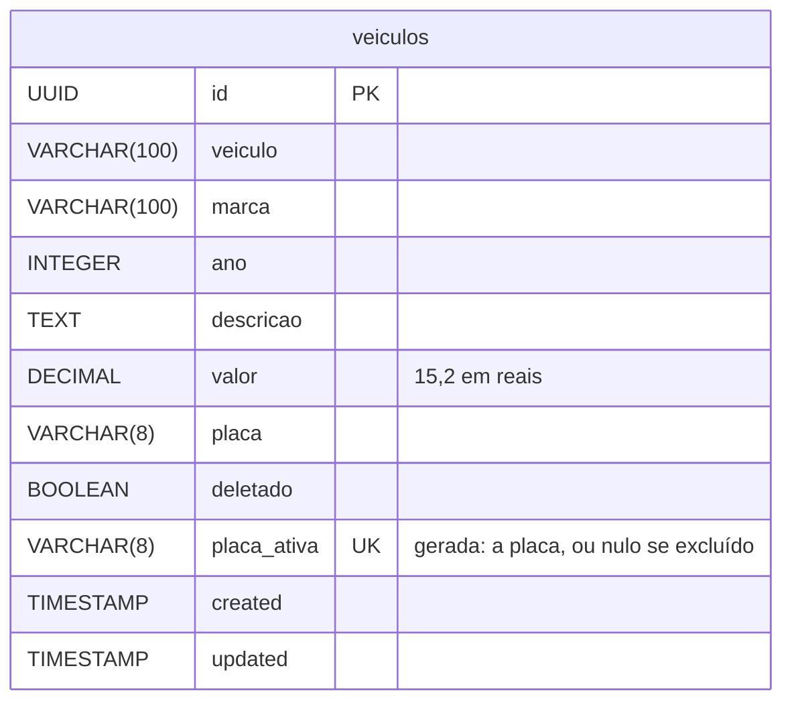

# 🚗 Desafio Controle Veículos

<div align="center">
  
  
  
  
  
  
  
  
</div>

<br>

> 🎯 **API REST em Java 17 e Spring Boot 4 para cadastrar veículos e consultar o valor deles em dólar**, com login JWT, perfis de acesso, cotação vinda de duas APIs públicas e cache no Redis.

Fiz o projeto em 2025, para estudar autenticação JWT, cache e integração com APIs externas no Spring Boot. Em 2026 voltei a ele para ver se funcionava de verdade: a conversão para dólar saía 25 vezes maior, os filtros da listagem não filtravam e quase todo erro chegava ao cliente como um 403 vazio.

## 📋 Índice

- [🚀 Como rodar](#-como-rodar)
- [🔐 Autenticação](#-autenticação)
- [📚 Endpoints](#-endpoints)
- [📏 Regras](#-regras)
- [📨 Envelope de resposta](#-envelope-de-resposta)
- [🧩 Como o código funciona](#-como-o-código-funciona)
- [🔄 Revisitando o projeto em 2026](#-revisitando-o-projeto-em-2026)
- [📄 Licença](#-licença)

## 🚀 Como rodar

Precisa do JDK 17 ou mais novo e do Docker. O `compose.yaml` sobe o PostgreSQL 17, já com o banco `desafio_controle_veiculos`, e o Redis:

```bash
docker compose up -d
```

```bash
./mvnw spring-boot:run
```

No Windows, use `mvnw.cmd`. A API sobe em `http://localhost:8080`, e o Liquibase cria a tabela na primeira subida.

A configuração vem de variáveis de ambiente, com padrão para rodar localmente:

| Variável | Padrão |
|---|---|
| `DB_URL` | `jdbc:postgresql://localhost:5432/desafio_controle_veiculos` |
| `DB_USERNAME` | `postgres` |
| `DB_PASSWORD` | `postgres` |
| `REDIS_HOST` | `localhost` |
| `REDIS_PORT` | `6379` |
| `JWT_SECRET` | um segredo de desenvolvimento, que precisa ser trocado fora da máquina local |

O Redis é só cache: sem ele a API funciona igual e busca a cotação a cada consulta.

A documentação fica no Swagger, em `http://localhost:8080/swagger-ui/index.html`, e o JSON do OpenAPI em `/v3/api-docs`. O botão Authorize recebe o token do login.

Os testes rodam com `./mvnw test`, sem Docker: sobem a aplicação com H2 e com a cotação fixa em 5,00. O `./mvnw verify` também confere a formatação do código, e o `./mvnw spotless:apply` corrige.

## 🔐 Autenticação

Dois usuários ficam em memória:

| Usuário | Senha | Perfil | Pode |
|---|---|---|---|
| 👤 `user` | `user123` | USER | 📖 Consultar |
| 👑 `admin` | `admin123` | USER e ADMIN | 📖 Consultar, ✏️ cadastrar, alterar e excluir |

O login devolve um token que vale 24 horas:

```bash
curl -X POST http://localhost:8080/auth/login \
  -H "Content-Type: application/json" \
  -d '{"username":"admin","password":"admin123"}'
```

```json
{
  "message": {"codigo": 0, "descricao": "Sucesso"},
  "data": {"token": "eyJhbGciOiJIUzM4NCJ9...", "type": "Bearer"}
}
```

As outras rotas recebem o token no cabeçalho `Authorization: Bearer <token>`.

## 📚 Endpoints

| Método | Rota | Perfil | O que faz | Sucesso |
|---|---|---|---|---|
| `POST` | `/auth/login` | 🌐 público | Gera o token | 200 |
| `GET` | `/api/veiculos` | 👤 USER | Lista com filtros, paginação e ordenação | 200 |
| `GET` | `/api/veiculos/{id}` | 👤 USER | Busca um veículo | 200 |
| `GET` | `/api/veiculos/relatorios/por-marca` | 👤 USER | Quantidade de veículos por marca | 200 |
| `POST` | `/admin/veiculos` | 👑 ADMIN | Cadastra | 201, com o endereço do veículo no `Location` |
| `PUT` | `/admin/veiculos/{id}` | 👑 ADMIN | Altera todos os campos | 200 |
| `PATCH` | `/admin/veiculos/{id}` | 👑 ADMIN | Altera só os campos enviados | 200 |
| `DELETE` | `/admin/veiculos/{id}` | 👑 ADMIN | Exclui | 204, sem corpo |

A listagem aceita `marca` (parte do nome, sem diferenciar maiúscula), `ano`, `minPreco` e `maxPreco` (em reais), além de `page`, `size` e `sort`, como em `?marca=honda&sort=valor,desc&size=5`.

## 📏 Regras

- Modelo, marca, ano, valor e placa são obrigatórios. Modelo e marca vão até 100 caracteres, a placa até 8, e o valor não pode ser negativo.
- No `PATCH`, campo ausente mantém o valor atual, e campo enviado segue as mesmas regras do cadastro.
- A placa não pode repetir entre os veículos cadastrados, nem quando dois cadastros chegam ao mesmo tempo.
- A exclusão é lógica: o veículo some das consultas e do relatório, mas continua no banco, e a placa dele pode ser cadastrada de novo.
- O valor é cadastrado em reais e sai em dólar, dividido pela cotação do momento. Cada API de cotação tem 30 segundos para responder antes de a próxima ser consultada.
- Dado inválido volta com 400, falta de login com 401, USER em rota de ADMIN com 403, veículo inexistente com 404, placa repetida com 422 e cotação indisponível com 503.

## 📨 Envelope de resposta

Toda resposta da API com corpo vem no mesmo formato (a documentação do Swagger fica de fora): `message` com um código de retorno e a descrição, e `data` com o conteúdo, quando houver. Vale para sucesso, erro de regra, erro de validação, falta de login e até para a rota que não existe. A única resposta sem corpo é o 204 da exclusão.

| Código | Status | Quando |
|---|---|---|
| `0` | 200 ou 201 | Sucesso |
| `-1` | 422 | Placa já cadastrada em outro veículo |
| `-2` | 404 | Veículo não encontrado |
| `-70` | 401 | Sem login, senha errada, ou token inválido ou vencido |
| `-71` | 403 | O perfil do usuário não tem acesso à rota |
| `-80` | 503 | Nenhuma das duas APIs de cotação respondeu |
| `-90` | 400 | Campo inválido ou obrigatório, com a lista de campos em `data.fields` |
| `-91` | 400 ou 405 | Requisição inválida: JSON malformado, tipo errado, método que a rota não aceita |
| `-92` | 404 | Rota não encontrada |
| `-99` | 500 | Erro interno |

O status HTTP diz a categoria do problema, e o código diz qual foi. O 404 do veículo que não existe e o da rota que não existe, por exemplo, são diferentes para quem consome a API: um é dado, o outro é erro de integração. O cliente testa `message.codigo` e não precisa interpretar texto.

O padrão de mercado para erros é o Problem Details (RFC 9457), que uso em outros projetos. Aqui mantive o envelope porque ele já existia no projeto original, com os códigos de retorno, e porque cobre também as respostas de sucesso: o cliente lê sempre o mesmo formato. O custo é que ferramentas que entendem Problem Details não entendem este formato sozinhas.

Cadastro de um Civic de R$ 120.000 com o dólar a 5,22:

```json
{
  "message": {"codigo": 0, "descricao": "Sucesso"},
  "data": {"id": "829f692d-6db4-41e2-ac46-8d7cb43d7668", "veiculo": "Civic", "marca": "Honda", "ano": 2020, "descricao": "Sedan", "valor": 23010.11, "placa": "ABC1D23"}
}
```

Listagem com `?marca=honda&sort=valor,desc&size=5`, com a página no formato do `PagedModel` do Spring Data:

```json
{
  "message": {"codigo": 0, "descricao": "Sucesso"},
  "data": {
    "content": [
      {"id": "829f692d-...", "veiculo": "Civic", "marca": "Honda", "ano": 2020, "descricao": "Sedan", "valor": 23010.11, "placa": "ABC1D23"},
      {"id": "7cd9a674-...", "veiculo": "Fit", "marca": "Honda", "ano": 2019, "descricao": null, "valor": 15340.07, "placa": "FIT2B19"}
    ],
    "page": {"size": 5, "number": 0, "totalElements": 2, "totalPages": 1}
  }
}
```

Cadastro vazio:

```json
{
  "message": {"codigo": -90, "descricao": "Campo inválido ou obrigatório"},
  "data": {
    "fields": [
      {"field": "valor", "message": "não deve ser nulo"},
      {"field": "veiculo", "message": "não deve estar em branco"},
      {"field": "marca", "message": "não deve estar em branco"},
      {"field": "placa", "message": "não deve estar em branco"},
      {"field": "ano", "message": "não deve ser nulo"}
    ]
  }
}
```

Sem token:

```json
{"message": {"codigo": -70, "descricao": "Login necessário, ou token inválido ou vencido"}}
```

## 🧩 Como o código funciona

```
src/main/java/br/com/luizmatosdev/desafiocontroleveiculos/
├── controller/
│   ├── AuthController   # login
│   ├── api/             # consultas, com a interface openapi/ que carrega a documentação do Swagger
│   └── admin/           # cadastro, alteração e exclusão, também com a interface openapi/
├── service/             # VeiculoService, ValorDolarService e o envelope ResponseService
├── client/              # clientes da AwesomeAPI e da Frankfurter
├── entity/              # Veiculo e DadosVeiculo, os dados que chegam para cadastrar ou alterar
├── specification/       # filtros da listagem montados com Specification
├── repository/          # BaseRepository com a exclusão lógica e o VeiculoRepository
├── dto/, mapper/
├── enums/Retorno        # códigos de retorno do envelope
├── exception/
├── handler/             # erros da API, da segurança e do /error, todos no envelope
└── config/              # segurança, JWT, cache, OpenAPI
src/main/resources/db/changelog/   # migrations do Liquibase
```

- **Cotação com plano B e cache.** O `ValorDolarService` pede a cotação à AwesomeAPI e, se ela falhar ou passar de 30 segundos, à Frankfurter. O resultado fica 10 minutos no Redis, e a listagem busca a cotação uma vez para a página inteira. Se o Redis cair, o `CacheConfig` registra o erro e a cotação vem direto das APIs.
- **Conversão na saída.** O banco guarda o valor em reais, e o `VeiculoMapper` divide pela cotação ao montar a resposta. O valor em dólar acompanha o câmbio sem regravar nada.
- **Veículo que muda por métodos de negócio.** A entidade não tem setters: `Veiculo.cadastrar`, `alterar` e `alterarParcialmente` recebem um `DadosVeiculo`, e `trocaDePlacaPara` diz se a placa mudou. O service só busca, confere a placa, chama a entidade e salva.
- **Placa única garantida pelo banco.** O service confere a placa antes de salvar, e o índice único do banco pega os cadastros simultâneos que passam juntos pela conferência. A violação do índice vira a mesma resposta 422.
- **Exclusão lógica no repositório.** O `BaseRepository` troca o `delete` por um `UPDATE deletado = true`, e o `findById` e a `VeiculoSpecification` só enxergam o que não foi excluído.
- **Segurança sem sessão.** O `JwtAuthenticationFilter` lê o token uma vez por requisição e coloca o usuário no contexto. Token malformado, adulterado ou vencido segue sem usuário, e o `SecurityExceptionHandler` responde 401 no envelope.



## 🔄 Revisitando o projeto em 2026

A análise mostrou que o README prometia mais do que a API entregava. Os testes antigos passavam porque eram unitários com mocks, e um deles conferia justamente a conta errada do dólar. Escrevi os testes pela API primeiro, vi cada bug acontecer e só então corrigi.

### 🐛 Bugs corrigidos

| Bug | Causa | Correção |
|---|---|---|
| Valor em dólar 25 vezes maior (R$ 10.000 virava US$ 50.000 com o dólar a 5,00) | O mapper multiplicava o valor pela cotação | Divide pela cotação |
| Filtros e ordenação da listagem não faziam nada | Um `@Query` fixo no `findAll(Specification, Pageable)` descartava a Specification | Filtro de excluídos dentro da Specification e ordenação no `PageRequest` |
| Filtro de valor e de cor dariam 500 | Apontavam para os campos `preco` e `cor`, que não existem | `minPreco` e `maxPreco` filtram o valor; o filtro de cor saiu |
| Quase todo erro chegava como 403 sem corpo | O `/error` exigia login | `/error` público, e depois todos os erros no envelope |
| Sem token ou com senha errada, 403; com token inválido, erro 500 | Faltava o `authenticationEntryPoint`, e a exceção do jjwt escapava do filtro | 401 nos três casos |
| O cadastro aceitava qualquer coisa e quebrava no banco | Faltava `@Valid` no `POST` | 400 com a lista de campos inválidos |
| O `PATCH` gravava modelo em branco e dava 500 com placa longa | O DTO do `PATCH` não tinha nenhuma validação | Mesmas regras do cadastro para os campos enviados |
| Um veículo sem valor derrubava a listagem inteira | O mapper fazia a conta com `null` | O valor passou a ser obrigatório, e os veículos antigos sem valor saem com `valor: null` |
| 10 cadastros simultâneos da mesma placa passavam os 10 | A placa só era conferida pela aplicação, antes de salvar | Índice único no banco |
| Com o Redis fora, nenhuma rota de veículo respondia | O `@Cacheable` lançava a falha de conexão | O erro do cache vira aviso no log |
| Uma API de cotação travada prendia a requisição | O `RestTemplate` não tinha timeout | 30 segundos por API |
| Swagger fora do ar | springdoc 2 no Spring Boot 4, e as rotas exigiam login | springdoc 3 e rotas públicas |
| Falha nas duas APIs de cotação respondia 422 | Caía no handler das regras de negócio | 503 |
| Os testes rodavam num esquema diferente do de produção | O perfil de teste recriava as tabelas pelo Hibernate por cima do Liquibase | O perfil troca só o banco |

### 🧠 Decisões técnicas

**Valor em reais, resposta em dólar**

O README original dizia que o valor era "convertido para dólar", e a cotação das duas APIs é quantos reais vale um dólar. Guardar em reais e dividir na saída deixa o dado do banco estável e o valor em dólar sempre com a cotação do momento. O custo é que os filtros `minPreco` e `maxPreco` trabalham em reais, que é o que está no banco.

**Placa única só entre os veículos ativos**

Como a exclusão é lógica, um índice único simples na placa impediria cadastrar de novo a placa de um veículo excluído. No PostgreSQL, a solução natural é um índice parcial (`WHERE deletado = false`), mas o H2 dos testes não tem índice parcial. Usei uma coluna gerada, `placa_ativa`, que vale a placa no veículo ativo e fica nula no excluído, com índice único: os dois bancos ignoram os nulos no índice, e o mecanismo é o mesmo nos testes e em produção. A migration também rodou num PostgreSQL 17.

**Contrato HTTP**

O cadastro responde 201 com o endereço do veículo no `Location`, e a exclusão responde 204 sem corpo. A listagem saiu do `PageImpl` do Spring, que o próprio Spring avisa que não tem formato garantido, para o `PagedModel`, com `content` e `page`.

**Configuração por variável de ambiente**

Banco, Redis e segredo do JWT estavam fixos no código e no `application.properties`. Agora vêm de variáveis, com padrão só para a máquina local. Tirei também o `spring-boot-docker-compose`, que tentava subir o Docker junto com a aplicação e impedia rodar com PostgreSQL e Redis instalados direto.

**Testes pela API**

Os testes sobem a aplicação inteira com H2 e o esquema do Liquibase, e chamam as rotas com token de verdade. Só a cotação é fixa, para não depender da internet nem do Redis. Os clientes de cotação são testados contra um servidor HTTP local, com resposta certa, erro, JSON quebrado, porta fechada e demora maior que o timeout. São 66 testes no total.

**Organização do código**

Depois dos bugs, reorganizei o código sem mudar o que a API faz:

- **Formatação automática.** Spotless com palantir-java-format, verificado no `./mvnw verify`, que também tirou os imports sem uso.
- **Código sem uso removido.** Um conversor de DTO que ninguém chamava, anotações do Lombok que não geravam nada e o Spring REST Docs sem nenhum documento.
- **Nomes corrigidos.** O pacote `especification`, os dois handlers chamados `handleAtivacaoException` e a interface de documentação do admin, que não seguia o nome da outra.
- **Entidade sem setters** (tell, don't ask). Antes, o service mudava o veículo campo a campo e repetia os seis campos no `PUT` e no `PATCH`. Agora a entidade muda por métodos com nome de negócio, e o `DadosVeiculo` evita que ela dependa dos DTOs da API.
- **Sem interface de implementação única.** `IVeiculoService` e `IValorDolarService` tinham uma implementação cada e ninguém trocava uma pela outra. Saíram, e a documentação foi para as classes.
- **Service sem repetição.** Busca por id, montagem da resposta e checagem da troca de placa estavam copiadas em até quatro métodos.
- **JWT lido uma vez.** O filtro lia o token três vezes, e o jjwt já recusa assinatura errada e token vencido na primeira.
- **Clientes de cotação iguais e com log.** Cada um era montado de um jeito, e os dois engoliam qualquer exceção sem registrar o motivo.
- **Regras que deixei de fora.** Não envolvi o valor num objeto `Money`: a única conta com dinheiro é a divisão pela cotação, e ela já fica num lugar só, o `VeiculoMapper`. E a entidade tem tantos campos quanto a tabela, então a regra de no máximo duas variáveis por classe não cabe nela.
- **Mesmo resultado.** Gravei as respostas de 57 chamadas, cobrindo todas as rotas e os casos de erro, antes de cada rodada de refatoração, e comparei depois de cada commit. Ficaram idênticas.

## 📄 Licença

[MIT](LICENSE)

---

<div align="center">
  <p>Desenvolvido por <strong>Luiz Matos</strong></p>
  <p>
    <a href="https://github.com/luiz-matos">GitHub</a> •
    <a href="https://www.linkedin.com/in/luizeduardomatos/">LinkedIn</a>
  </p>
</div>
