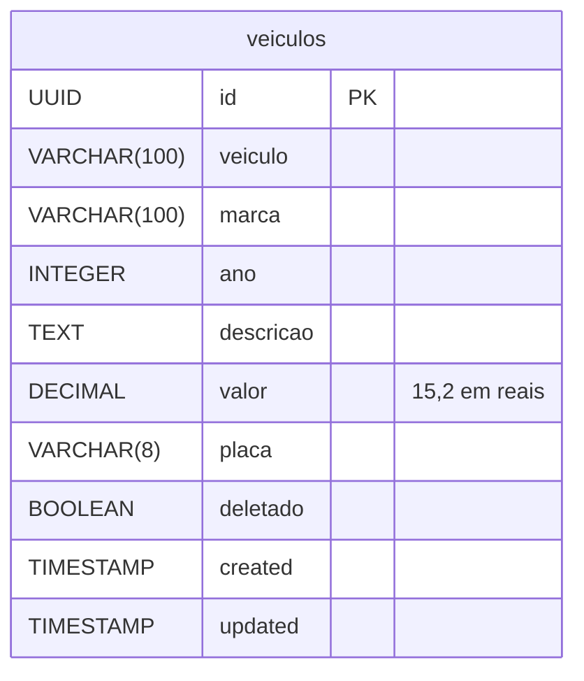

# Desafio Veículos API

API REST em Java 17 e Spring Boot 4 para cadastrar veículos e consultar o valor deles em dólar, com login JWT, perfis de acesso, cotação vinda de duas APIs públicas e cache no Redis.

O projeto é de 2025. Em 2026 voltei a ele para ver se funcionava de verdade: a conversão para dólar saía 25 vezes maior, os filtros da listagem não filtravam e quase todo erro chegava ao cliente como um 403 vazio.

## Como rodar

Precisa do JDK 17 ou mais novo e do Docker. O `compose.yaml` sobe o PostgreSQL 17, já com o banco `desafio_veiculos`, e o Redis:

```bash
docker compose up -d
```

```bash
./mvnw spring-boot:run
```

No Windows, use `mvnw.cmd`. A API sobe em `http://localhost:8080`, e o Liquibase cria a tabela na primeira subida.

A conexão vem de variáveis de ambiente, com padrão para rodar localmente:

| Variável | Padrão |
|---|---|
| `DB_URL` | `jdbc:postgresql://localhost:5432/desafio_veiculos` |
| `DB_USERNAME` | `postgres` |
| `DB_PASSWORD` | `postgres` |
| `REDIS_HOST` | `localhost` |
| `REDIS_PORT` | `6379` |
| `JWT_SECRET` | um segredo de desenvolvimento, que precisa ser trocado fora da máquina local |

A documentação fica no Swagger, em `http://localhost:8080/swagger-ui/index.html`, e o JSON do OpenAPI em `/v3/api-docs`. O botão Authorize recebe o token do login.

Os testes rodam com `./mvnw test`, sem Docker: sobem a aplicação com H2 e com a cotação fixa em 5,00. O `./mvnw verify` também confere a formatação do código, e o `./mvnw spotless:apply` corrige.

## Autenticação

Dois usuários ficam em memória:

| Usuário | Senha | Perfil | Pode |
|---|---|---|---|
| `user` | `user123` | USER | Consultar |
| `admin` | `admin123` | USER e ADMIN | Consultar, cadastrar, alterar e excluir |

O login devolve um token que vale 24 horas:

```bash
curl -X POST http://localhost:8080/auth/login \
  -H "Content-Type: application/json" \
  -d '{"username":"admin","password":"admin123"}'
```

```json
{"token":"eyJhbGciOiJIUzM4NCJ9...","type":"Bearer"}
```

As outras rotas recebem o token no cabeçalho `Authorization: Bearer <token>`.

## Endpoints

| Método | Rota | Perfil | O que faz |
|---|---|---|---|
| `POST` | `/auth/login` | público | Gera o token |
| `GET` | `/api/veiculos` | USER | Lista com filtros, paginação e ordenação |
| `GET` | `/api/veiculos/{id}` | USER | Busca um veículo |
| `GET` | `/api/veiculos/relatorios/por-marca` | USER | Quantidade de veículos por marca |
| `POST` | `/admin/veiculos` | ADMIN | Cadastra |
| `PUT` | `/admin/veiculos/{id}` | ADMIN | Altera todos os campos |
| `PATCH` | `/admin/veiculos/{id}` | ADMIN | Altera só os campos enviados |
| `DELETE` | `/admin/veiculos/{id}` | ADMIN | Exclui |

A listagem aceita `marca` (parte do nome), `ano`, `minPreco` e `maxPreco` (em reais), além de `page`, `size` e `sort`, como em `?marca=Honda&sort=valor,desc&size=5`.

## Regras

- Modelo, marca, ano e placa são obrigatórios. Modelo e marca vão até 100 caracteres, a placa até 8, e o valor, que é opcional, não pode ser negativo.
- No `PATCH`, campo ausente mantém o valor atual, e campo enviado segue as mesmas regras do cadastro.
- A placa não pode repetir entre os veículos cadastrados.
- A exclusão é lógica: o veículo some das consultas e do relatório, mas continua no banco, e a placa dele pode ser cadastrada de novo.
- O valor é cadastrado em reais e sai em dólar, dividido pela cotação do momento.
- Dado inválido ou ordenação por campo que não existe voltam com 400, falta de login com 401, USER em rota de ADMIN com 403, veículo inexistente com 404, placa repetida com 422 e cotação indisponível com 503.

A consulta, o cadastro, a alteração e o relatório respondem num envelope com um código de retorno e os dados, e os erros de regra vêm no mesmo formato. A listagem devolve a página do Spring direto. Cadastro de um Civic de R$ 10.000 com o dólar a 5,00:

```json
{
  "message": {"codigo": 0, "descricao": "Sucesso"},
  "data": {"id": "a1f3c2e0-...", "veiculo": "Civic", "marca": "Honda", "ano": 2020, "descricao": "Sedan", "valor": 2000.00, "placa": "ABC1234"}
}
```

Cadastro vazio:

```json
{
  "message": {"codigo": -90, "descricao": "Campo inválido ou obrigatório"},
  "data": {
    "fields": [
      {"field": "veiculo", "message": "não deve estar em branco"},
      {"field": "marca", "message": "não deve estar em branco"},
      {"field": "ano", "message": "não deve ser nulo"},
      {"field": "placa", "message": "não deve estar em branco"}
    ]
  }
}
```

Relatório por marca:

```json
{
  "message": {"codigo": 0, "descricao": "Sucesso"},
  "data": [{"quantidade": 1, "marca": "Fiat"}, {"quantidade": 2, "marca": "Honda"}, {"quantidade": 1, "marca": "Toyota"}]
}
```

## Como o código funciona

```
src/main/java/br/com/luizmatosdev/desafioveiculos/
├── controller/
│   ├── AuthController   # login
│   ├── api/             # consultas, com a interface openapi/ que carrega a documentação do Swagger
│   └── admin/           # cadastro, alteração e exclusão, também com a interface openapi/
├── service/             # VeiculoService, ValorDolarService e o envelope ResponseService
├── client/              # clientes da AwesomeAPI e da Frankfurter
├── specification/       # filtros da listagem montados com Specification
├── repository/          # BaseRepository com a exclusão lógica e o VeiculoRepository
├── entity/, dto/, mapper/
├── enums/Retorno        # códigos de retorno do envelope
├── exception/, handler/ # exceções e o handler que as transforma em status HTTP
└── config/              # segurança, JWT, cache, OpenAPI
src/main/resources/db/changelog/   # migrations do Liquibase
```

- **Cotação com plano B e cache.** O `ValorDolarService` pede a cotação à AwesomeAPI e, se ela falhar, à Frankfurter. O resultado fica 10 minutos no Redis, então as consultas desse intervalo fazem uma chamada externa só, e a listagem busca a cotação uma vez para a página inteira.
- **Conversão na saída.** O banco guarda o valor em reais, e o `VeiculoMapper` divide pela cotação ao montar a resposta. O valor em dólar acompanha o câmbio sem regravar nada.
- **Exclusão lógica no repositório.** O `BaseRepository` troca o `delete` por um `UPDATE deletado = true`, e o `findById` e a `VeiculoSpecification` só enxergam o que não foi excluído.
- **Segurança sem sessão.** O `JwtAuthenticationFilter` lê o token uma vez por requisição e coloca o usuário no contexto. Token malformado, adulterado ou vencido segue sem usuário, e a rota protegida responde 401.
- **Documentação separada do controller.** As anotações do Swagger ficam nas interfaces de `openapi/`, e os controllers só implementam.



## Revisitando o projeto em 2026

A análise mostrou que o README prometia mais do que a API entregava. Os testes antigos passavam porque eram unitários com mocks, e um deles conferia justamente a conta errada do dólar. Escrevi os testes pela API primeiro, vi cada bug acontecer e só então corrigi.

### Bugs corrigidos

| Bug | Causa | Correção |
|---|---|---|
| Valor em dólar 25 vezes maior (R$ 10.000 virava US$ 50.000 com o dólar a 5,00) | O mapper multiplicava o valor pela cotação | Divide pela cotação |
| Filtros e ordenação da listagem não faziam nada | Um `@Query` fixo no `findAll(Specification, Pageable)` descartava a Specification | Filtro de excluídos dentro da Specification e ordenação no `PageRequest` |
| Filtro de valor e de cor dariam 500 | Apontavam para os campos `preco` e `cor`, que não existem | `minPreco` e `maxPreco` filtram o valor; o filtro de cor saiu |
| Quase todo erro chegava como 403 sem corpo | O `/error` exigia login | `/error` público |
| Sem token ou com senha errada, 403; com token inválido, erro 500 | Faltava o `authenticationEntryPoint`, e a exceção do jjwt escapava do filtro | 401 nos três casos |
| O cadastro aceitava qualquer coisa e quebrava no banco | Faltava `@Valid` no `POST` | 400 com a lista de campos inválidos |
| O `PATCH` gravava modelo em branco e dava 500 com placa longa | O DTO do `PATCH` não tinha nenhuma validação | Mesmas regras do cadastro para os campos enviados |
| Um veículo sem valor derrubava a listagem inteira | O mapper fazia a conta com `null` | Veículo sem valor sai com `valor: null` |
| Swagger fora do ar | springdoc 2 no Spring Boot 4, e as rotas exigiam login | springdoc 3 e rotas públicas |
| Falha nas duas APIs de cotação respondia 422 | Caía no handler das regras de negócio | 503 |
| Os testes rodavam num esquema diferente do de produção | O perfil de teste recriava as tabelas pelo Hibernate por cima do Liquibase | O perfil troca só o banco |

### Decisões técnicas

**Valor em reais, resposta em dólar**

O README original dizia que o valor era "convertido para dólar", e a cotação das duas APIs é quantos reais vale um dólar. Guardar em reais e dividir na saída deixa o dado do banco estável e o valor em dólar sempre com a cotação do momento. O custo é que os filtros `minPreco` e `maxPreco` trabalham em reais, que é o que está no banco.

**Configuração por variável de ambiente**

Banco, Redis e segredo do JWT estavam fixos no código e no `application.properties`. Agora vêm de variáveis, com padrão só para a máquina local. Tirei também o `spring-boot-docker-compose`, que tentava subir o Docker junto com a aplicação e impedia rodar com PostgreSQL e Redis instalados direto.

**Testes pela API**

Os testes novos sobem a aplicação inteira com H2 e o esquema do Liquibase, e chamam as rotas com token de verdade. Só a cotação é fixa, para não depender da internet nem do Redis. Um deles sobe o servidor numa porta, porque o erro do `/error` não aparece pelo MockMvc. São 46 testes no total.

**Organização do código**

Depois dos bugs, limpei o código sem mudar o que a API faz:

- **Formatação automática.** Spotless com palantir-java-format, verificado no `./mvnw verify`, que também tirou os imports sem uso.
- **Código sem uso removido.** Um conversor de DTO que ninguém chamava, anotações do Lombok que não geravam nada e o Spring REST Docs sem nenhum documento.
- **Nomes corrigidos.** O pacote `especification`, os dois handlers chamados `handleAtivacaoException` e a interface de documentação do admin, que não seguia o nome da outra.
- **Entidade sem `@Data`.** O `equals` e o `hashCode` com todos os campos fazem o veículo mudar de hash depois de salvo.
- **Service sem repetição.** Busca por id, montagem da resposta e checagem da troca de placa estavam copiadas em até quatro métodos.
- **JWT lido uma vez.** O filtro lia o token três vezes, e o jjwt já recusa assinatura errada e token vencido na primeira.
- **Clientes de cotação iguais e com log.** Cada um era montado de um jeito, e os dois engoliam qualquer exceção sem registrar o motivo.
- **Mesmo resultado.** Gravei as respostas de 57 chamadas, cobrindo todas as rotas e os casos de erro, antes da primeira mudança, e comparei depois de cada commit. Ficaram idênticas.

## Licença

[MIT](LICENSE)

Desenvolvido por **Luiz Matos**. [GitHub](https://github.com/luizmatosdev) · [LinkedIn](https://linkedin.com/in/luizmatosdev)
